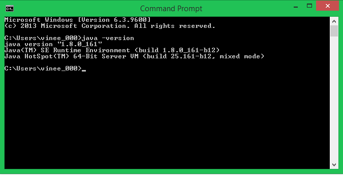

### Vineet's PhD Thesis All Code
This is a local version of the tetrad project that builds upon graphical structure learning in the case of mixed data.

For the full tetrad project, please visit: https://github.com/cmu-phil/tetrad

Included in here are a suite of java files for running causal discovery methods that handle latent variables and mixed continuous and discrete datasets. My thesis is focused upon incorporating prior knowledge into these methods for biomedical research applications. Many of the outputs of this project are focused on analzying observational, static, multi-omics datasets. 

Here is a pictoral description of my thesis:

# Steps to use the releases of this thesis

### 1. Look at the releases tab on the main page of this github project

Look over the description of each of the releases, and determine if any of them are useful for your data. The first number in the release version corresponds to the method. So 1.0 and 1.5 are all the same program just different versions. But 3.0 is a whole different program for a different purpose. 

### 2. Install Java 

In order to run these methods you will need to have Java installed on your machine, please see these instructions for doing so: https://www.informationweek.com/desktop/how-to-install-java-runtime-environment-in-windows/d/d-id/1099686

### 3. Set Java Home

Windows 10 and Windows 8
1. In Search, search for and then select: System (Control Panel)
2. Click the Advanced system settings link.
3. Click Environment Variables. In the section System Variables, find the PATH environment variable and select it. Click Edit. If the PATH environment variable does not exist, click New.
4. In the Edit System Variable (or New System Variable) window, add the following to the PATH variable (**make sure this is separated by a semicolon from everything that was already in there**)
"C:/Program Files/Java/jre1.8.0_161/bin;" 
5. Click OK. Close all remaining windows by clicking OK.
6. Check to make sure it worked by opening a command prompt window and typing "java -version" and pressing enter. If it says "java" is not recognized as an internal command, then it did not work and you need to try again or contact me!

You should see something like this image: 

Note: If you have a different version of Java then you need to change the 1.8.0_161 in the path variable to your version, navigate to the Program Files/Java/ directory on your computer to double check!

For Mac OS, you usually don't need to do anything Step 2

### 4. Organize your Data

Next be absolutely sure that your .jar file, your datasets, and all files that will be used by your .jar file are in the same folder on you computer. 

Then, navigate to the directory with your files on your windows command prompt or mac terminal by using the command "cd" 
Example: cd C:/Users/vineet/Documents/Directory_With_My_Files

### 5. Run the jar

Run the jar according to the instructions in that particular release. Note that the format will always be java -jar jarFileName.jar

Also, depending upon which method you are using you may need to use the other scripts in other languages to preprocess input files.

Thanks for visiting! Have fun!

